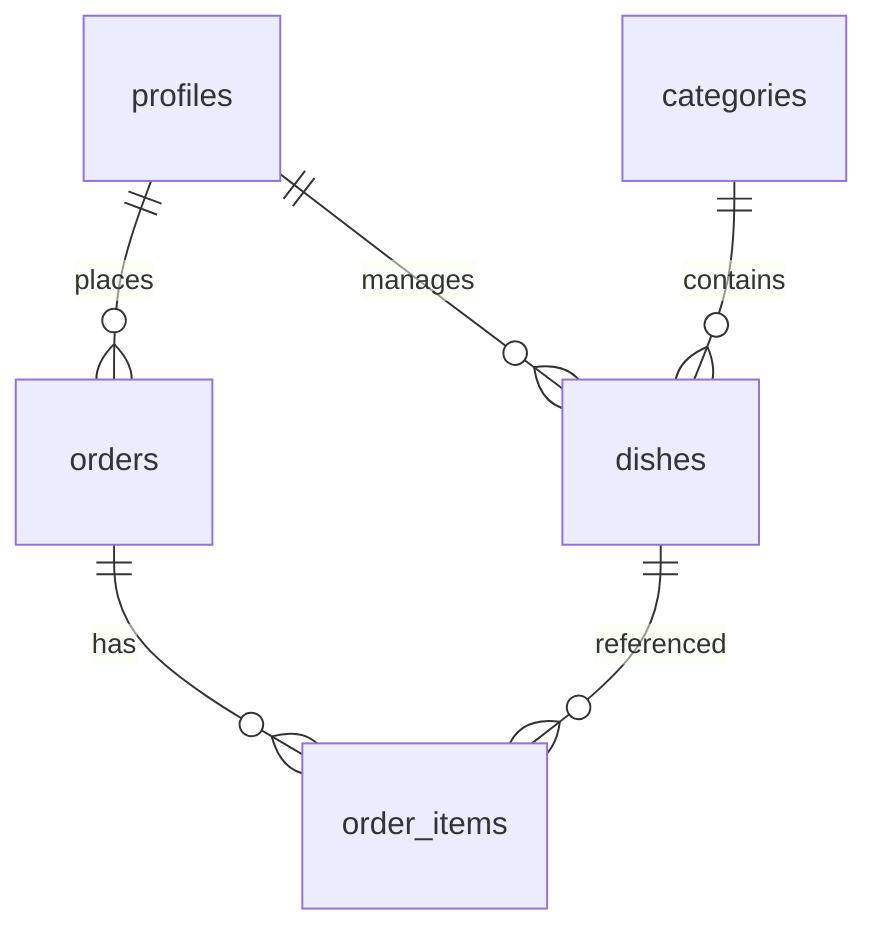

# 数据库设计文档

> 项目：我的菜单 · 载体：Supabase（PostgreSQL） · 更新日期：2026-07-28

## 1. 概述

- **数据库类型**：PostgreSQL（Supabase 托管）。
- **身份**：自定义账号密码（`profiles.password_hash`，bcrypt），**不依赖** `auth.users`；会话由 Next.js 签发 httpOnly JWT Cookie。
- **设计原则**：
  - 订单明细与订单头分离；明细保存下单时名称/单价/图片快照。
  - 菜品图片存 **ImgBB URL**（文本）。
  - 业务读写经服务端 **Service Role** + 应用层鉴权；表已 ENABLE RLS 且无 anon 策略。

权威 DDL：[`supabase/migrations/001_init.sql`](../supabase/migrations/001_init.sql)。

## 2. ER 关系

## 3. 表结构说明

### 3.1 `profiles`

| 字段 | 类型 | 约束 | 说明 |
|------|------|------|------|
| id | uuid | PK，default gen_random_uuid() | |
| account | text | NOT NULL，UNIQUE，`^[A-Za-z0-9]+$` | 登录账号 |
| password_hash | text | NOT NULL | bcrypt |
| nickname | text | NOT NULL | 昵称 |
| avatar_url | text | 可空 | 头像 |
| role | text | `user` / `admin`，default `user` | 角色 |
| created_at / updated_at | timestamptz | default now() | |

### 3.2 `categories` / `dishes` / `orders` / `order_items`

与初版设计一致：分类、菜品（含上下架）、订单头、订单明细快照。详见迁移 SQL。

**菜品唯一约束**：`(category_id, name)`。

**索引**：`idx_dishes_category_status`、`idx_dishes_status_updated`、`idx_orders_user_created`、`idx_order_items_order`。

## 4. 行级安全（RLS）

全部业务表 ENABLE RLS，**不配置 anon 读写策略**。应用使用 `SUPABASE_SERVICE_ROLE_KEY` 在服务端访问，并在 Action 内校验登录态与 admin 角色。

## 5. 种子数据

| 账号 | 密码 | 角色 |
|------|------|------|
| admin | admin123 | 管理员 |
| user | user123 | 普通用户 |

另含 7 个分类与若干演示菜品。

## 6. 变更记录

| 日期 | 说明 |
|------|------|
| 2026-07-28 | 初版设计 |
| 2026-07-28 | 落地：自定义 password_hash，去掉 auth.users 依赖；迁移 `001_init.sql` |
