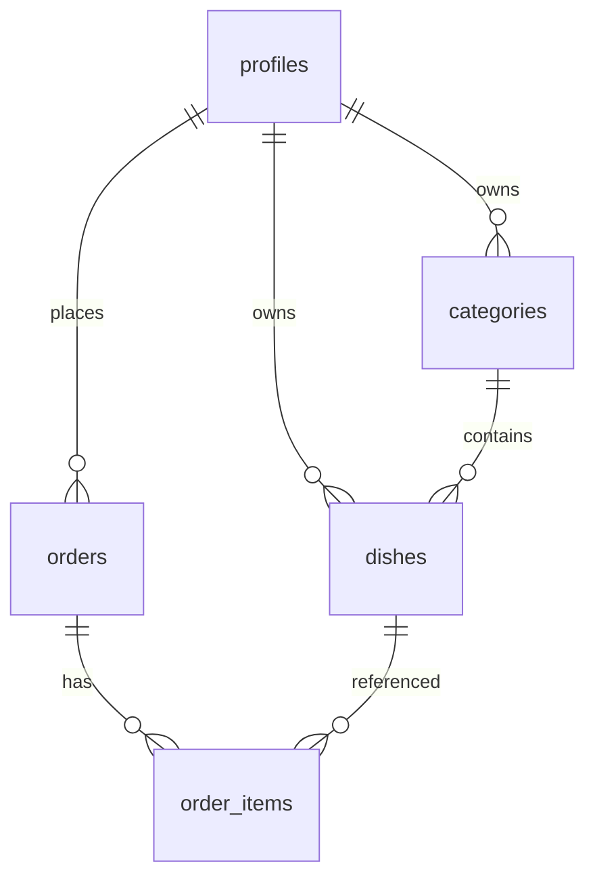

# 数据库设计文档

> 项目：我的菜单 · 载体：Supabase（PostgreSQL） · 更新日期：2026-07-28

## 1. 概述

- **多租户边界**：以 **登录用户 `profiles.id`** 隔离；每人只看见、管理自己的分类 / 菜品 / 订单。
- **身份**：自定义账号密码（`profiles.password_hash`，bcrypt）+ JWT Cookie。
- **菜品图**：ImgBB URL。
- 业务经 Service Role + 应用层按 `user_id` 过滤。

权威 DDL：[`supabase/migrations/001_init.sql`](../supabase/migrations/001_init.sql)  
若库中仍是旧版全局菜单，再执行 [`002_per_user_menu.sql`](../supabase/migrations/002_per_user_menu.sql)。

## 2. ER 关系

## 3. 表结构要点

### 3.1 `categories`

| 字段 | 说明 |
|------|------|
| user_id | 所属用户，FK → profiles，CASCADE |
| name | 与 user_id 联合唯一 |

### 3.2 `dishes`

| 字段 | 说明 |
|------|------|
| user_id | 所属用户 |
| category_id | 必须属于同一 user_id 的分类 |
| 唯一 | `(user_id, category_id, name)` |

### 3.3 `orders` / `order_items`

订单按 `user_id` 隔离；明细保留下单快照。

## 4. 种子账号

| 账号 | 密码 | 说明 |
|------|------|------|
| admin | admin123 | **管理员**；独立菜单；可进入用户管理 |
| user | user123 | 普通用户；独立菜单（示例菜品不同） |

新用户无分类时，应用会调用 `ensureDefaultCategories` 自动写入默认分类。

管理员可通过「用户管理」创建普通用户（`role=user`）；**不可编辑或删除**账号 `admin` / `role=admin`。

## 5. 变更记录

| 日期 | 说明 |
|------|------|
| 2026-07-28 | 初版 |
| 2026-07-28 | **每用户独立菜单**：categories/dishes 增加 `user_id` |
| 2026-07-28 | admin 种子角色恢复为 `admin`；迁移 `003_admin_role.sql` |
