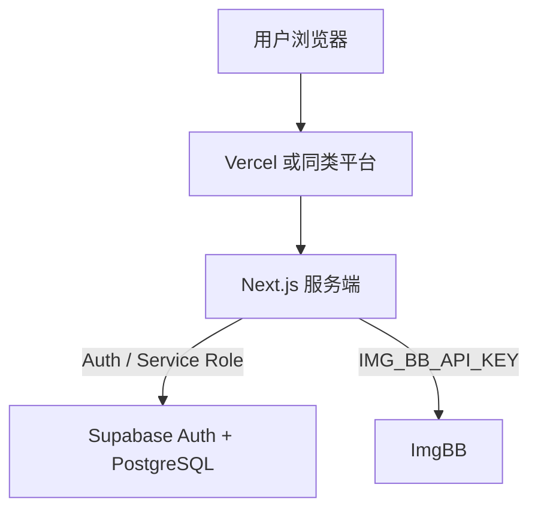

# 部署文档

> 项目：我的菜单（Next.js + Supabase + ImgBB）· 更新日期：2026-07-28

## 1. 部署架构

- **应用**：Next.js（SSR、Server Actions、middleware、`/api/upload`）。
- **数据**：Supabase；迁移在控制台或 CI 执行，不随前端静态资源发布。
- **图片**：ImgBB 公网 URL；应用只存 URL。

## 2. 环境说明

| 环境 | 用途 | 说明 |
|------|------|------|
| 本地 | 开发 | `.env.local` |
| 预发 / 生产 | 对外 | 平台环境变量；建议独立 Supabase 项目 |

## 3. 配置与密钥（环境变量）

| 变量 | 必填 | 说明 |
|------|------|------|
| `NEXT_PUBLIC_SUPABASE_URL` | 是 | 项目 URL |
| `NEXT_PUBLIC_SUPABASE_PUBLISHABLE_KEY` 或 `NEXT_PUBLIC_SUPABASE_ANON_KEY` | 是 | 可发布密钥 |
| `SUPABASE_SERVICE_ROLE_KEY` | 是 | **仅服务端**，业务读写必填 |
| `SESSION_SECRET` | 建议 | JWT 会话签名 |
| `IMG_BB_API_KEY` | 是（启用上传） | **仅服务端** |

**密钥管理**：Service Role、ImgBB Key 只放部署平台密钥区；**禁止** `NEXT_PUBLIC_` 前缀。参考根目录 [.env.example](../.env.example)。

## 4. 构建产物

| 命令 | 说明 |
|------|------|
| `npm run build` | 生产构建 |
| `npm run start` | 本地验证产物 |

若使用 `next/image` 加载 ImgBB 域名，须在 `next.config` 配置 `images.remotePatterns`（如 `i.ibb.co`）。

## 5. 部署步骤（以 Vercel 为例）

### 5.1 首次部署

1. 在 Supabase SQL Editor 执行迁移（`supabase/migrations/*`，实现阶段提供）。
2. 执行迁移：新库用 `001_init.sql`；旧库追加 `002_per_user_menu.sql`。  
3. 用演示账号验证：admin / user 菜单互不相同；均可进入「我的菜单」管理。

### 5.2 常规发布

推送生产分支触发构建即可。若有 SQL 变更，**先迁移再发版**（或兼容双写）。

### 5.3 回滚

在平台将上一稳定 Deployment 提升为 Production；数据库回滚需单独评估，勿盲目执行破坏性 SQL。

## 6. 数据库与迁移

- 生产变更前先在预发验证。
- 表结构见 [database-design.md](./database-design.md)。
- 订单明细含快照字段，删菜品不应导致历史订单无法展示。

## 7. 健康检查清单

| 检查项 | 预期 |
|--------|------|
| `/login` | 可打开 |
| 错误密码 | 明确错误提示 |
| 点菜结算 | 生成订单且金额正确 |
| 非本人菜品 / 订单 | 不可见、不可改 |
| 上传接口未登录 | 401 |

## 8. 监控与日志（建议）

- 平台函数日志关注：登录失败率、上传 5xx、下单失败。
- ImgBB 限额与失败需有可读错误，避免前端无限重试。

## 9. 变更记录

| 日期 | 说明 |
|------|------|
| 2026-07-28 | 初版：Vercel + Supabase + ImgBB |
