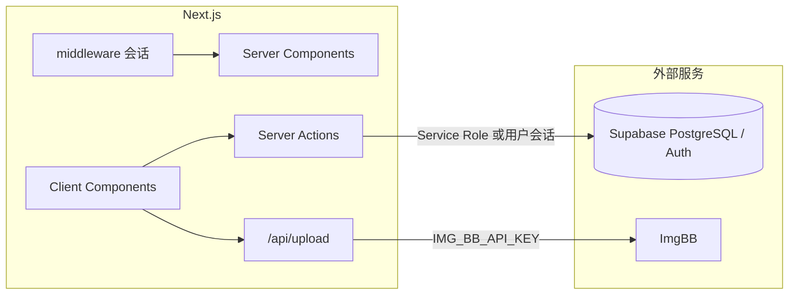

# 开发指南

> 项目：我的菜单（Next.js 移动端点菜 + Supabase + ImgBB）· 更新日期：2026-07-28

## 1. 环境要求

| 工具 | 建议版本 | 说明 |
|------|----------|------|
| Node.js | 20.x / 22.x | 与当前 Next 大版本兼容即可 |
| 包管理器 | npm（默认） | 亦可用 pnpm / yarn |
| Supabase | 云端项目 | 执行 `supabase/migrations` 中 SQL |
| ImgBB | API Key | 菜品图上传，仅服务端使用 |

## 2. 技术架构概要



- **会话**：自定义账号密码（`profiles`）+ httpOnly JWT Cookie（`menu_session`）；中间件保护业务路由。
- **菜单 / 订单**：Server Actions 读写；菜单读走 `unstable_cache`（标签 `menu`）。
- **图片**：客户端选图 → `POST /api/upload` → ImgBB → URL 写入菜品。
- **购物车**：仅客户端 `sessionStorage`，结算时 `createOrder`。
- **布局**：移动端 `max-w-md`；底部双 Tab「点菜 / 我的」；品牌黄对齐设计图。

详见 [database-design.md](./database-design.md)、[api.md](./api.md)、[cache-design.md](./cache-design.md)。

## 3. 建议仓库结构（落地时对齐）

```
/
├── middleware.ts                 # 无会话 → /login
├── app/
│   ├── actions/
│   │   ├── auth.ts               # 登录 / 登出 / 当前用户
│   │   ├── menu.ts               # 分类、菜品读取、菜单缓存刷新
│   │   ├── order.ts              # 下单、订单列表/详情
│   │   └── dish-admin.ts         # 菜品 CRUD（admin）
│   ├── api/upload/route.ts       # ImgBB 上传
│   ├── login/page.tsx
│   ├── page.tsx                  # 点菜 Tab
│   ├── mine/page.tsx             # 我的 Tab
│   ├── orders/page.tsx           # 点菜记录
│   ├── manage/
│   │   ├── page.tsx              # 菜品列表管理
│   │   └── dish/page.tsx         # 新增/编辑（可用 query id）
│   └── layout.tsx                # 壳层、Tab、metadata
├── components/
│   ├── common/                   # TabBar、Loading、空态等
│   └── features/
│       ├── auth/
│       ├── menu/                 # 分类栏、菜品卡、购物车栏
│       ├── order/
│       └── manage/
├── lib/
│   ├── supabase/                 # server / client / middleware 客户端
│   └── constants/                # 品牌文案、限制（上传大小等）
├── supabase/migrations/          # SQL 迁移
├── docs/                         # 本目录
├── .env.example
└── README.md
```

## 4. 环境变量

复制 `.env.example` 为 `.env.local`：

| 变量 | 必填 | 说明 |
|------|------|------|
| `NEXT_PUBLIC_SUPABASE_URL` | 是 | Supabase 项目 URL |
| `NEXT_PUBLIC_SUPABASE_PUBLISHABLE_KEY` 或 `NEXT_PUBLIC_SUPABASE_ANON_KEY` | 是 | 浏览器 / SSR 匿名可发布密钥（以控制台为准） |
| `SUPABASE_SERVICE_ROLE_KEY` | 是（服务端写推荐） | **仅服务端**，禁止 `NEXT_PUBLIC_` |
| `IMG_BB_API_KEY` | 是（管理上传） | **仅服务端**，ImgBB |

勿将 Service Role、ImgBB Key 提交 Git。

## 5. 常用命令

```bash
npm install
npm run dev          # http://localhost:3000
npm run build
npm run start
```

## 6. 开发约定

1. **只改任务所需**：不做顺手大重构。
2. **密钥边界**：上传与写库只在服务端；客户端只收图片 URL。
3. **权限**：管理 Action 统一 `requireAdmin()`；UI 按 `role` 隐藏操作，服务端仍校验。
4. **文档同步**：功能合并后更新 `docs/` 对应专篇，并在 `docs/change/` 记迭代。
5. **Next 版本**：若仓库已安装 Next，编写前先查阅 `node_modules/next/dist/docs/` 中与当前版本相关的指南，注意破坏性变更。

## 7. UI / 交互要点（对齐 PRD）

- 登录：居中简约，无多余模块；LOGO 使用 `UtensilsCrossed`（lucide）。
- 点菜：左分类右列表（**滚动联动**）；点击菜品打开详情弹层；底栏购物车与 Tab 留白；底 Tab「点菜 / 我的」。
- 我的：头像信息 + 列表入口。
- 图标：统一 [lucide-react](https://lucide.dev/)，尺寸见 `lib/constants/icon-size.ts` 与 [icons.md](./icons.md)。
- 加载 / 空态 / 错误重试文案与 [PRD.md](./PRD.md) §8 一致。

## 8. FAQ

| 问题 | 建议 |
|------|------|
| 改菜后点菜页仍旧？ | 确认写操作调用了 `revalidateTag('menu')`；或下拉刷新 |
| 上传失败？ | 检查 `IMG_BB_API_KEY`、文件大小/类型、服务端网络 |
| 普通用户看到管理按钮？ | UI 按 role 隐藏；接口必须 403 |
| 账号如何对接 Auth？ | 可用 `{account}@menu.local` 映射邮箱，或自定义 token 方案；实现时在 api.md 补最终方案 |

## 9. 相关文档

- [PRD.md](./PRD.md)
- [deployment.md](./deployment.md)
- [iteration-design.md](./iteration-design.md)
